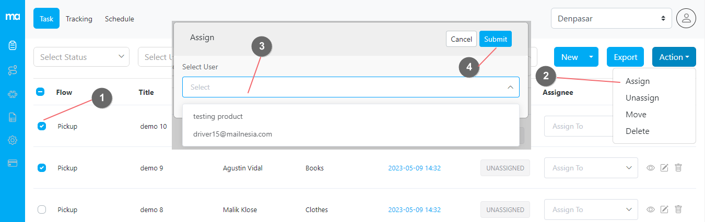

A Task can have either one of the three status:
1. Unassigned ➝ When the task has not been assigned to anyone
2. Ongoing ➝ When the task has been assigned to someone but not done yet
3. Done ➝ When the task has been done

<blockquote style="color: blue;">
    A task can be assigned to multiple people; if a task is assigned to multiple people, they can all see it and its details, but only one person can actually do it and mark it as done.
</blockquote>

## Assigning each task individually

If you want to assign each task individually, select one or more assignees from the assignee column in the task.

<i>Assigning tasks individually from the Task menu</i>

## Assigning many tasks at once

Multiple tasks can be assigned at once using the multiple selection boxes; follow these steps to do so
1. Check the select box on the tasks you want to assign
2. Click on Action➝Assign
3. Select the assignee(s) on the popup menu
4. Click on the submit button to assign multiple tasks at once

<blockquote style="color: blue;">
    Similarly, multiple tasks can be unassigned, moved, or deleted from the action button.
</blockquote> 

<i>Assigning multiple tasks using the Action➝Assign feature</i>
