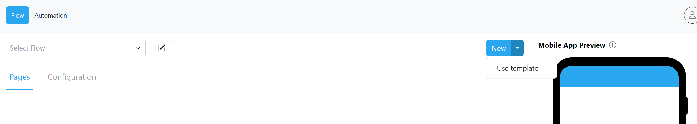
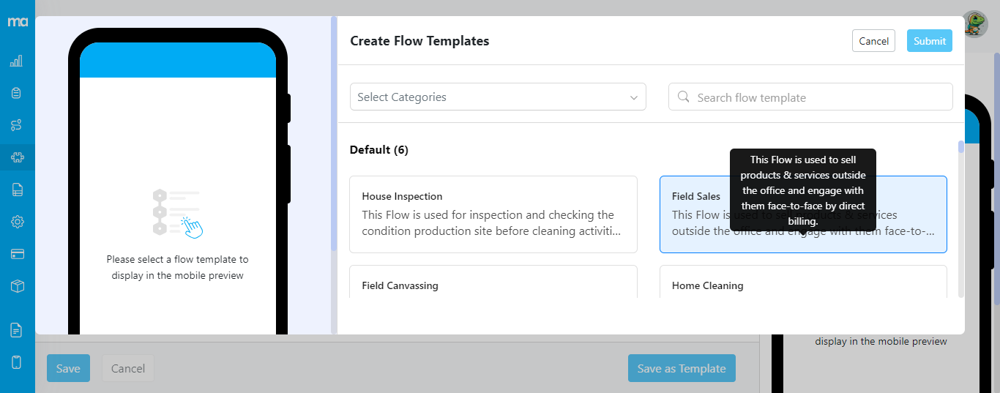
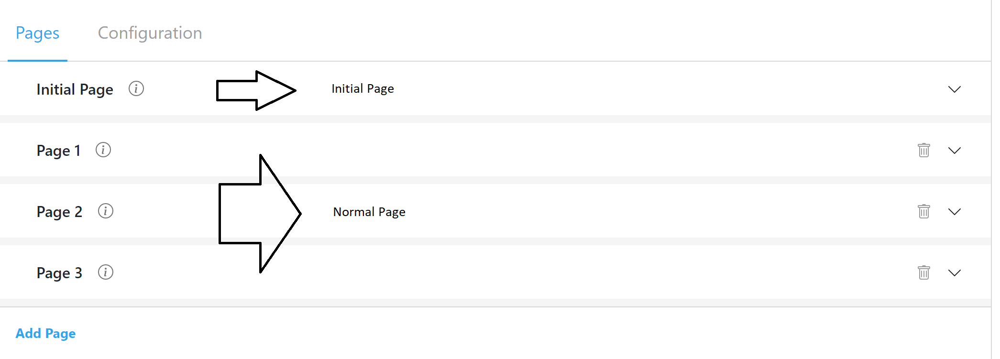
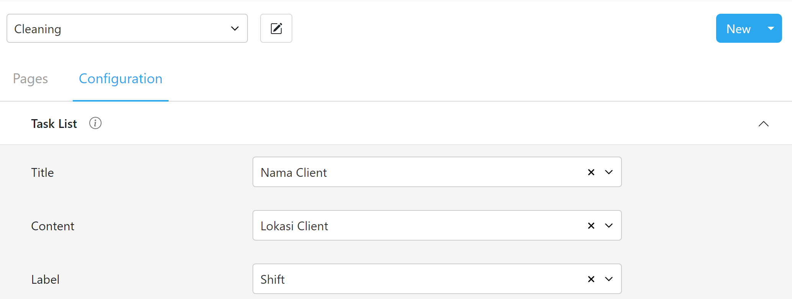
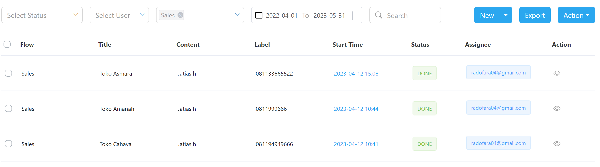
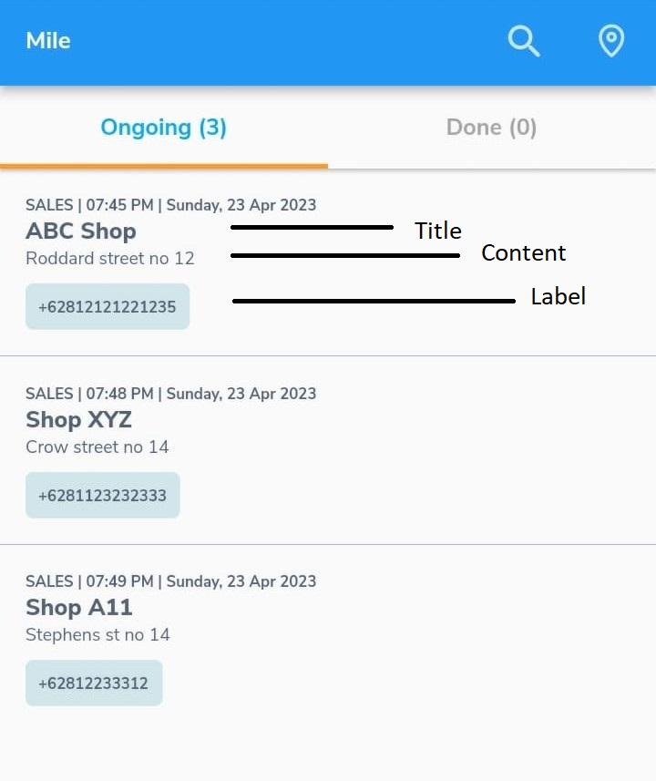
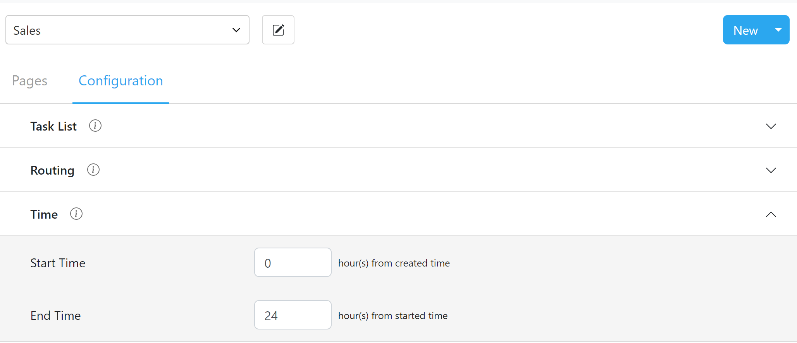

Flow is segregated into pages, and each page can have several components that are suited to the field process

MileApp lets you create a flow from scratch or edit one from an existing template from the Flow page; some commonly used flows are:
- Delivery
- Pickup
- Inspection
- Canvassing
- Field Sales

MileApp has many ready-to-use editable templates to start with.

<i>Creating a flow from an existing template from the Flow page</i>

<i>Various flow templates to start with</i>

Once you have created a flow from a template or a new one from scratch, you can start editing its pages and components.

## Pages
The types of pages are: 
- <b>Initial Page</b> ➝ This page is shown to the user when the task is first created; all input information on this page needs to be filled in when the task is created; there can be only 1 Initial Page.
- <b>Normal Page</b> ➝ These pages are shown to the user when the task is being done; you can add multiple pages by using the <b>Add Page</b> button.

<i>Initial Page and Normal Page</i>

Why is the Initial Page important?
The normal life cycle of a task is 
1. <b>Task Created</b> ➝ When the admin or field user first creates the task
2. <b>Task Assigned</b> ➝ When the admin is assigning the task to the field user
3. <b>Task Done</b> ➝ When the field user has done the task

In most cases, the user that creates the task is different from the one doing it (for example, the admin creates the task, assigns it to the field user, and then the field user does the task); therefore, the initial page distinguishes information to be inputted by the admin from the field user.

MileApp also allows the task to be created directly by the user doing it, skipping the assignment part altogether; in cases such as this, the initial page doesn't have any difference from the other pages.

## Components

Each page can have one or more components to be used by the users; the types of components are:
- <b>View</b> ➝ View component lets the user to show information; it can be of various types with a unique property; for example, a view of the type coordinate can be clicked to show its location on the map.
- <b>Input</b> ➝ The Input component is used for the user to fill in information such as text, time, or currency data
- <b>Select</b> ➝ The Select component is used for the user to input a choice from selection; it can be configured between button, checkbox, or dropdown type. 
- <b>Photo</b> ➝ The Photo component enables users to take photos from Android or iOS devices 
- <b>Signature</b> ➝ The Signature component will be shown as a signature pad where user can draw their signature.
- <b>Bill</b> ➝ The Bill component lets the user create billable items and calculate the total price for the user.
- <b>List</b> ➝ The List component lets the user build a list of items. 

## Flow Configuration

### Task List

Configuring which input field is the Title, Content, and Label will enable users to view the task's primary information in the task list; these fields can be configured from the Flow➝Configuration menu after selecting the flow.

<i>Configuring the Title, Content, and Label from the flow menu</i>

The Title, Content, and Label of a flow will be shown in the mobile field app and web task list while viewing the list of tasks; it is important that these are configured to show <b>primary information</b> to ease the <b>assigning</b> process.

<i>The title, content, and label are shown as primary information in the task list menu on the web</i>

<i>The Title, Content, and Label are shown in the task list menu on the field app</i>

### Time

There are two-time configurations for a flow:
1. <b>Start Time</b> ➝ Time when the task will be shown to the assigned user
2. <b>End Time</b> ➝ Time when the task will be hidden from the assigned user

The default time configurations can be set by defining how many hours it should be from when the time task is created.

<i>Setting up Time configuration from Flow➝Confiugration➝Time menu</i>

Configuring Start Time and End Time will only set the default time when the task is created, but the user can still change both these values when the task is being created.