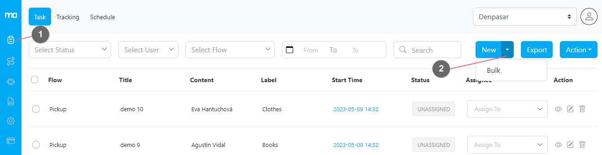
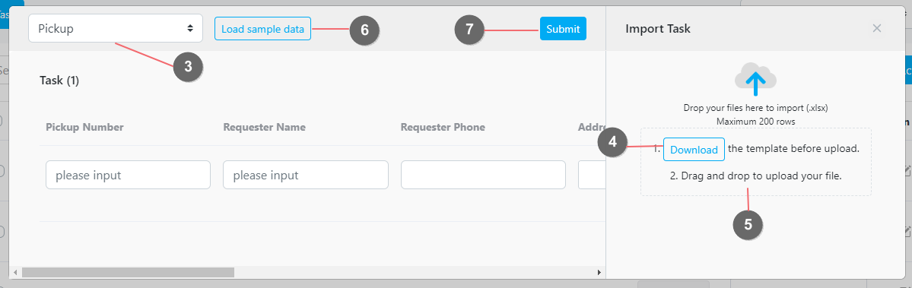
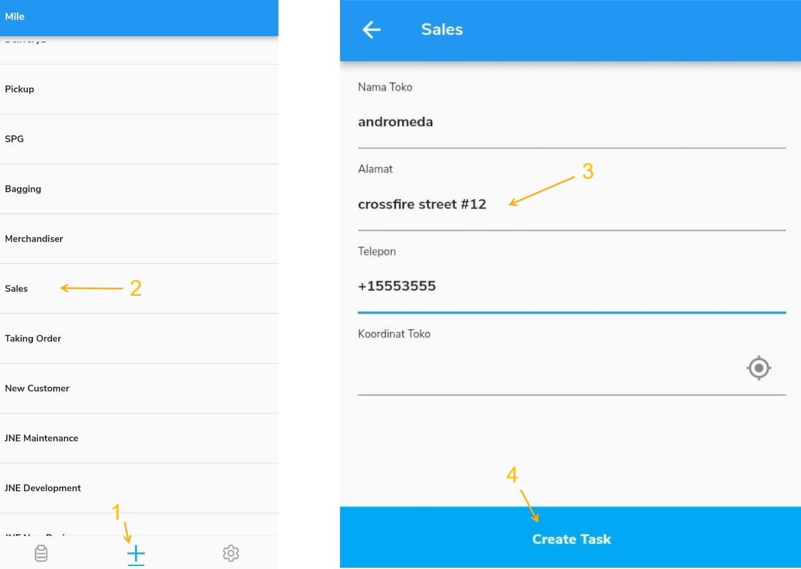

The task can be created in several ways:
- Web Form ➝ Create a single task using an input form
- Excel Upload ➝ Create multiple tasks by uploading an Excel template
- Field App ➝ Create task directly from the field application
- API ➝ Read our RESTful API documentation here
- Automation ➝ Learn how to trigger task creation from another task event here
- Scheduled ➝ Learn to create recurring tasks using Scheduler here

## Web Form

You can create a single task from the web form:
1. Open the task menu
2. Click on the New button on the task page
3. Select the flow on the popup form
4. Fill out the Initial Page form, and change the start time and end time if need be
5. Submit the form

<i>Creating one task using the web form</i>

## Excel Upload 

If you want to create multiple tasks in one go, you can use the New > Bulk method.
1. Open the task menu.
2. Click on the New > Bulk button on the task page

3. Select the flow on the popup form
4. Download the provided template and fill the template with Excel or other CSV reader
5. Upload the filled template by dropping it on the given space or by selecting the file.
6. You can also use our sample data to get started
7. Submit the form

<i>Uploading several tasks in a go using Excel upload</i>

## Field App
MileApp allows field users to start and do a new task on the go; this is handy in cases where the tasks are not predetermined beforehand 

Field users can start a task by opening the MileApp field application (Android and iOS)

1. clicking the + button in the middle of the bottom menu
2. Selecting the flow for the task
3. Fill in the initial page
4. Click on the Create Task button

<i>Creating tasks on the go from field application</i>
