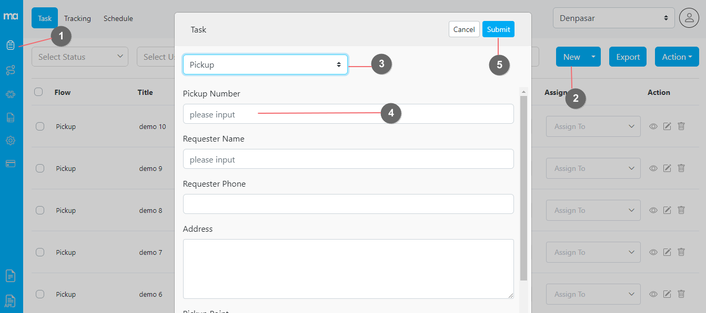

The task can be created in several ways:
- Web Form ➝ Create a single task using an input form
- Excel Upload ➝ Create multiple tasks by uploading an Excel template
- Field App ➝ Create task directly from the field application
- API ➝ Read our RESTful API documentation here
- Automation ➝ Learn how to trigger task creation from another task event here
- Scheduled ➝ Learn to create recurring tasks using Scheduler here

## Web Form

You can create a single task from the web form:
1. Open the task menu
2. Click on the New button on the task page
3. Select the flow on the popup form
4. Fill out the Initial Page form, and change the start time and end time if need be
5. Submit the form

<i>Creating one task using the web form</i>
