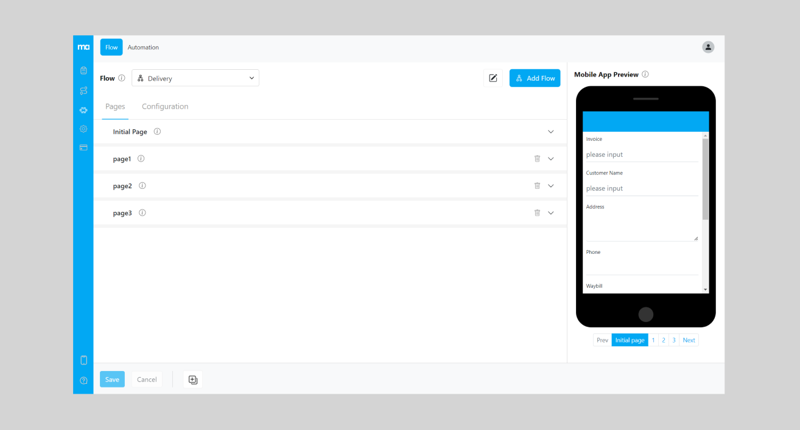

<b>Flow</b> in MileApp is the mobile field application workflow; setting it correctly is critical to the success of the field workers in doing their job efficiently. Flow defines how information is presented to the field workers and what data they need to fill in and update on the mobile app.

An organization is allowed to have an unlimited number of Flows irrespective of its license plan, making it possible for an organization to use MileApp in multiple field aspects; for example, an organization that acts as a distributor will be able to use MileApp for pickup, delivery and field sales, where in each Flow is allowed to have as many pages and components in them.

Components are the building blocks of flow; MileApp comes with various components that can be used in a flow, such as:
- View component ➝ used to present information to the user in the form of text, image, link, date, etc.
- Input component ➝ used to give input
- Select component ➝ used to give options 
- Photo component ➝ used to capture images from the camera
- Signature component ➝ used to verify identity
- Timer component ➝ used to track the duration of a task
- Voice Note Component ➝ Used to record audio